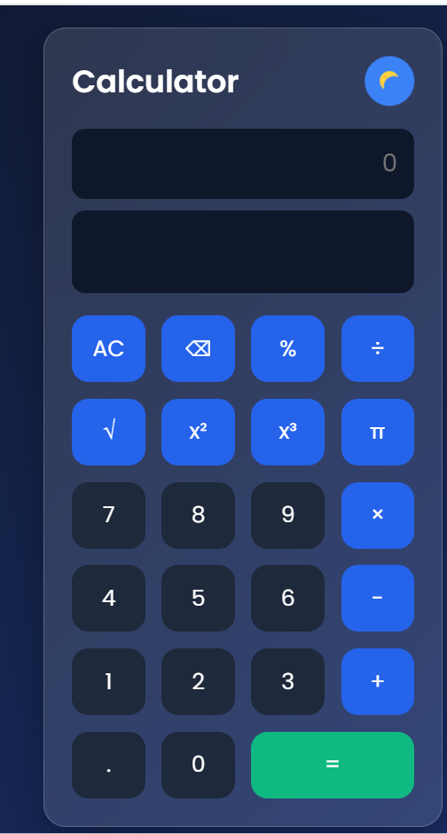
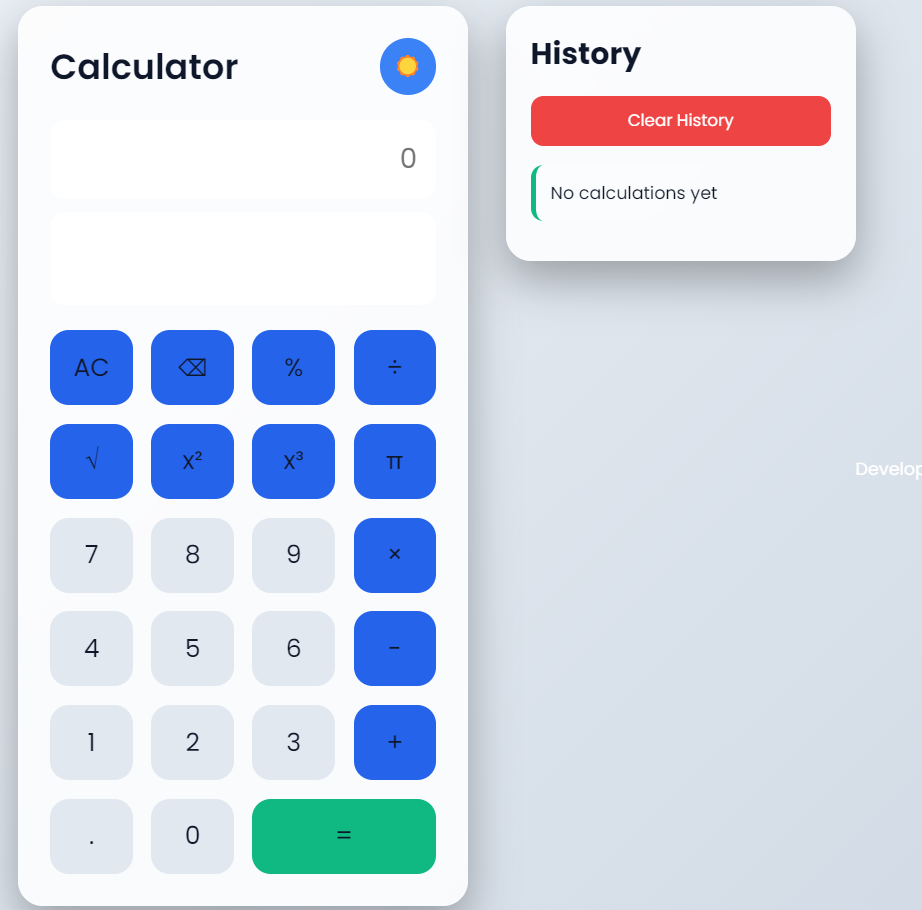
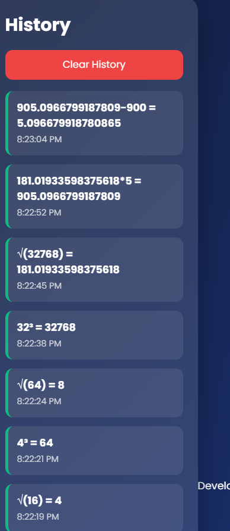

# 🚀 Professional Calculator

A modern, responsive, and feature-rich calculator built using **HTML, CSS, and JavaScript**. This project demonstrates frontend development fundamentals, DOM manipulation, event handling, responsive UI design, and browser storage.

---

## 📸 Preview

> Add your project screenshots here after uploading them to GitHub.

| Dark Theme | Light Theme | 
|------------|-------------|
|  |  |  


 | History | Home |
 |---------|-------|
 | | |

---

# ✨ Features

## 🧮 Calculator Features

- Addition
- Subtraction
- Multiplication
- Division
- Percentage Calculation
- Decimal Numbers
- Clear (C)
- Backspace (⌫)
- Live Result Preview
- Error Handling

---

## 🎨 User Interface

- Modern Glassmorphism Design
- Dark Mode
- Light Mode
- Responsive Layout
- Smooth Hover Effects
- Button Click Animations

---

## ⚡ Advanced Features

- Keyboard Support
- Calculation History
- Timestamp for Each Calculation
- Local Storage Support
- Auto Save History

---

# 🛠️ Tech Stack

| Technology | Purpose |
|------------|----------|
| HTML5 | Structure |
| CSS3 | Styling & Responsive Design |
| JavaScript (ES6) | Calculator Logic |
| Local Storage | Save Calculation History |

---

# 📂 Project Structure

```
Professional-Calculator/
│
├── assets/
│   ├── icons/
│   └── images/
│
├── screenshots/
│   ├── dark-mode.png
│   ├── light-mode.png
│   └── calculator.png
│
├── index.html
├── style.css
├── script.js
└── README.md
```

---

# 🚀 Getting Started

## Clone the Repository

```bash
git clone https://github.com/yourusername/Professional-Calculator.git
```

## Open the Project

Open the folder in **Visual Studio Code**.

## Run

Open **index.html** using **Live Server**.

---

# ⌨️ Keyboard Shortcuts

| Key | Action |
|------|--------|
| 0-9 | Numbers |
| + - * / | Operators |
| Enter | Calculate |
| Backspace | Delete Last Character |
| Escape | Clear Calculator |

---

# 📱 Responsive Design

The application works on:

- Desktop
- Laptop
- Tablet
- Mobile Devices

---

# 🎯 Learning Outcomes

Through this project, I strengthened my understanding of:

- HTML Semantic Structure
- CSS Grid & Flexbox
- JavaScript DOM Manipulation
- Event Listeners
- Local Storage
- Responsive Web Design
- UI/UX Design Principles

---

# 🔮 Future Improvements

- Scientific Calculator
- Calculation Memory
- Voice Input
- Multiple Themes
- Currency Converter
- Unit Converter
- Calculation Export
- PWA Support

---

# 👨‍💻 Author

Janagam Akhila 

B.Tech Mathematics and Computing (2027)

Aspiring Software Engineer

GitHub: https://github.com/akhilajanagam799

LinkedIn: https://www.linkedin.com/in/janagam-akhila-297b65307

---

# 📄 License

This project is created for learning purposes and internship demonstration.

Feel free to fork, improve, and learn from it.


